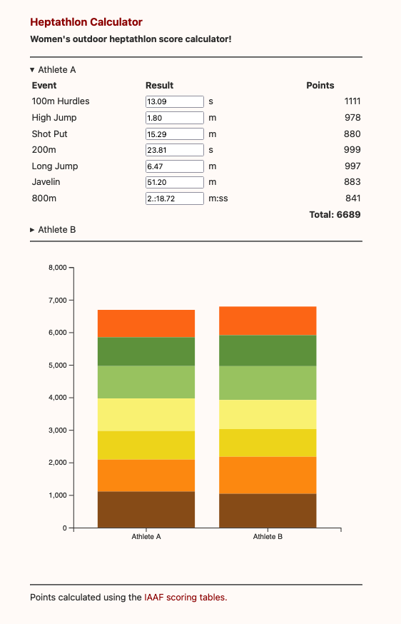

# Heptathlon Calculator

Calculator for women's outdoor heptathlon scores with comparison chart.

Compiled with Scala.js to run in the browser.

:running_woman: __[Try it out online!](https://carpetscheme.github.io/heptathlon/)__

## Build

Requires: sbt, node.

Run tests:
```
$ sbt test
```
Fast JavaScript build with reload (to `target/scala-2.13/scalajs-bundler/main/heptathlon-fastopt-bundle.js`):    
```
$ sbt ~fastOptJs::webpack
```
Full JavaScript build (to `target/scala-2.13/scalajs-bundler/main/heptathlon-opt-bundle.js`):
```
$ sbt fullOptJS::webpack
```


